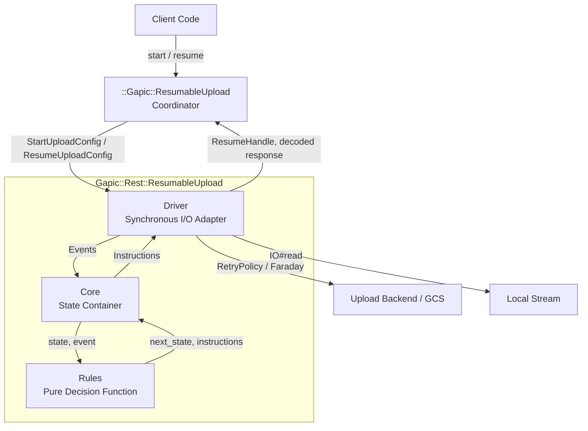

# Resumable Upload Protocol (RUP) Implementation Guide

## 1. System Architecture

The Resumable Upload Protocol (RUP) implementation in `gapic-common` is structured across three distinct tiers to separate network execution, protocol state progression, and state transition decision logic:



### 1.0 Domain Vocabulary
*   **Upload**: Server-side entity created by a successful session initiation (`start`), identified by `upload_url`.
*   **Resume Handle (`ResumeHandle`)**: An immutable snapshot (`upload_url`, `chunk_size`) identifying an upload for resumption.
*   **Coordinator (`::Gapic::ResumableUpload`)**: Client-side transfer coordinator and the only public entry point. Reusable: it builds one `Driver` per run and retains the last one. Per-run arguments — the stream, sizes, the upload budget, the progress callback — are passed to the run, not to the coordinator.
*   **Run**: One invocation of `Driver#run` (either a start or resume execution). At most one run per coordinator at a time.

### 1.1 Driver (Synchronous I/O Adapter)
The `Driver` executes all operations with side-effects. It interacts with HTTP transport via `Gapic::Rest::ClientStub`, reads binary data from local input streams, tracks monotonic execution deadlines, and dispatches progress callbacks. 

Crucially, the Driver delegates all **Category 1 (Transient)** transport retries directly to `Gapic::Common::RetryPolicy`. Transient retries occur entirely within the Driver's network execution wrapper. The `Core` state machine is never exposed to transient noise, receiving only verified successful HTTP responses or terminal transport exceptions.

The Driver exposes:
*   `Driver#resume_handle`: Returns a `ResumeHandle` (or `nil` if initiation has not established an upload URL, or if the session is `:rejected`, `:cancelled`, or `:success`; completed uploads are not resumable). Reading this property mid-run provides a best-effort snapshot of current session parameters.
*   `Driver#upload_url`: Returns the raw protocol state upload URL under any status (`:active`, `:success`, `:rejected`, `:cancelled`).

### 1.2 Core (State Container)
The `Core` maintains the immutable `State` snapshot. When `Core#dispatch(event)` is invoked by the Driver, Core forwards `@state`, the event, and static configuration to `Rules.decide`. Core mutates `@state` to `decision.next_state`, records the decision in `@last_decision`, and returns `decision.instructions` back to the Driver. Core contains zero protocol branching logic and zero side effects.

### 1.3 Rules (Pure Decision Function)
The `Rules` module encapsulates the Resumable Upload Protocol state transitions as a pure functional module. Given a state snapshot, an input event, and configuration, `Rules.decide` evaluates the transition router and returns a `Decision` snapshot containing `from_status`, `shape`, `recipe`, `next_state`, and `instructions`.

### 1.4 Stream Buffering
Because arbitrary Ruby `IO` objects (network sockets, pipes, `STDIN`) do not support seeking (`#seek`), the Driver buffers the current in-flight chunk in memory (bounded by chunk size, default: 8MB). When `RetryPolicy` executes transport retries, or when `Core` triggers Category 2 recovery realignments within the buffered range, the Driver retransmits directly from memory. The buffer is discarded only after receiving a `200 OK` durably confirming receipt of the chunk.

### 1.5 Coordinator (`::Gapic::ResumableUpload`)
The coordinator (`lib/gapic/resumable_upload.rb`) is the only public entry point above `Driver`, and the object a generated client method returns instead of a response. It lives outside the `Gapic::Rest::ResumableUpload` namespace on purpose: it is not part of the protocol implementation, it is the layer built on top of it. It builds the per-run configuration, constructs one `Driver` per run, retains it, and serves its readers from it.

#### Construction
`::Gapic::ResumableUpload.new(client_stub_proc:, initial_request_proc:, response_type:, initial_headers: {}, start_retry_policy: nil, control_plane_retry_policy: nil, data_plane_retry_policy: nil, error_handler: nil, method_name: nil)`

*   **Procs only; there is no value form.** `client_stub_proc` returns the `Gapic::Rest::ClientStub` and is called at the top of every run, so a client that cannot perform REST calls can still hand back a working coordinator and fail only when an upload is attempted. `initial_request_proc` returns the `[url, body]` pair for initiation and is called by `#start` only, so a coordinator built without a request message is still fully functional for resuming.
*   `response_type` is the protobuf message class the final body is decoded into. `nil` returns the raw body.
*   `initial_headers` is stringified (keys and values) before reaching `StartUploadConfig`, which rejects any key in `RESERVED_INITIAL_HEADERS` (`X-Goog-Upload-Protocol`, `X-Goog-Upload-Command`, `X-Goog-Upload-Offset`, `X-Goog-Upload-Header-Content-Type`, `X-Goog-Upload-Header-Content-Length`, in any casing). Callers shape the content descriptors with `content_type:` and `upload_size:` on the run; pass-through headers such as `X-Goog-Upload-Header-Content-Disposition` remain permitted.
*   `method_name` is forwarded to `Driver`, which prefixes it onto the per-request logging names.
*   **No `logger` argument.** `Driver#initialize` already falls back to `client_stub.logger`.

#### Run Signatures
*   `#start(stream:, content_type: nil, upload_size: nil, chunk_size: nil, upload_timeout: nil, on_progress: nil)`
*   `#resume(stream:, resume_handle: nil, content_type: nil, upload_size: nil, upload_timeout: nil, on_progress: nil)`

Everything a run owns is a per-run keyword, because the coordinator outlives the run. Two arguments are deliberately not: the control- and data-plane retry policies sit on the constructor (they describe the upload path, not one run), and `chunk_size` is a `#start` argument only — a resumed run takes its chunk size from the `ResumeHandle`, because the server reports its granularity during initiation and a resumed run skips initiation.

The budget keyword is named `upload_timeout` even though the config member behind it is `timeout`: a generated client already has a per-call `timeout` in scope, which in an upload bounds the initiation request alone and reaches the protocol through `start_retry_policy`. The two are three orders of magnitude apart and must not be confusable.

Order of operations in each run, before any byte is read from the stream:
1.  Claim the run slot: raise `SessionStateError` if a run is already in flight.
2.  `#resume` only: reject a stream that is not positioned at byte 0, then resolve the `ResumeHandle`.
3.  `client_stub_proc.call` — raises here if REST is unavailable.
4.  `#start` only: `initial_request_proc.call` -> `[url, body]`.
5.  Build `StartUploadConfig` or `ResumeUploadConfig`, then `Driver.new`, and retain it.
6.  Run it; decode and return, or wrap and raise.

#### Reusability & Lifecycle
*   One coordinator, many runs, one `Driver` per run. A run started while another is in flight raises `SessionStateError`; a coordinator whose run has finished may legitimately start another one.
*   The run slot is released in an `ensure`, so every exit — a clean return, a protocol error, an `on_progress` callback raising, a `Thread#kill` — leaves the coordinator usable and the driver retained.
*   A failure while building the configuration (a reserved header, a non-positive `chunk_size`, a malformed retry policy) retains no driver at all, so it cannot disturb the resume handle an earlier run left behind.
*   Network execution occurs outside the mutex; the mutex guards only the lifecycle flag and the retained driver reference.

#### Readers
All read from the retained driver under the coordinator's mutex, are safe to call from another thread mid-run, and return a best-effort snapshot. All are `nil`/`false` before the first run.
*   `#resume_handle`: `Driver#resume_handle` — the upload URL and the resolved chunk size, or `nil` for a finalized upload.
*   `#resumable?`: `!resume_handle.nil?`.
*   `#running?`: the coordinator's own lifecycle flag.

`#upload_url` and `#chunk_size` are **not** exposed: both are fields of the `ResumeHandle` this set already returns.

#### Resume Forms
1.  **Bare**: `upload.resume(stream: io)` takes the retained driver's `resume_handle`, and raises `ArgumentError` when there is none. That one rule covers a coordinator that has never run, a run that finished successfully, and a run that failed in a way the protocol considers unresumable.
2.  **Explicit handle**: `upload.resume(stream: io, resume_handle: handle)` — what the protocol's own errors carry, and what a caller persists between processes.

There is no explicit `upload_url:`/`chunk_size:` form: those are exactly the two fields of a `ResumeHandle`, so a caller holding them in a database row constructs one. Resuming against a finalized upload URL is undefined behavior: it queries the server and might return the response body or raise an error, depending on the server response.

#### Precondition on Stream Position for Resume
*   The stream must be positioned at byte 0 of the whole object, not at the server's acknowledged offset.
*   If `stream.respond_to?(:pos) && !stream.pos.zero?`, `#resume` raises `ArgumentError`.
*   A stream that reports no position is trusted, and `Driver` fast-forwards to the server-confirmed offset by seeking or by reading and discarding bytes.

#### Response Decoding
`response_type.decode_json body.to_s, ignore_unknown_fields: true`, identical to what a generated REST service stub does with a unary response. An empty or absent final body decodes to an empty message; malformed JSON raises `Google::Protobuf::ParseError`. A `nil` `response_type` returns the raw body — a `String`, or `nil` when the final response carried none. That is `@private` behavior, for this gem's own tests.

#### Error Handling
`error_handler` is a lambda that **returns** the exception to raise; it must not raise. A `nil` return, or a return of the original error, re-raises the original. When the original carries `HasResumeHandle` and the replacement does not, the replacement is extended with the mixin and given the original's handle, so a library-specific error type cannot erase the fact that the upload is resumable.

Only the run is wrapped. Argument and configuration errors are raised while the driver is still being built, and reach the caller as themselves.

#### Retry Policy Placement
All three planes reach the coordinator on the **constructor**; none is per-run. `start_retry_policy` is the documented one and comes from the generated method's `CallOptions`. `control_plane_retry_policy` and `data_plane_retry_policy` are `@private`: no generated client passes them, but `Gapic::Common`'s own integration harness does, which keeps recovery and retry-exhaustion tests on the production code path rather than on a hand-built `Driver`.

`Gapic::Rest::ResumableUpload.start_retry_policy_for(options)` (`@private`, beside `RetryPolicies::START_DEFAULTS`) converts per-call options into the initiation policy. It returns a **Hash**, never a policy object, because the protocol treats an object as a wholesale replacement — which would silently drop the initiation predicate that makes a missing `X-Goog-Upload-Status` retriable. It always sets `timeout:` from `options.timeout`, copies backoff settings and retry codes only where the caller set them (an empty `retry_codes` list counts as unset), and raises `ArgumentError` for a Proc retry policy.

---

## 2. Component Interfaces & Data Models

### 2.1 Initiation Configuration (`StartUploadConfig`)
```ruby
module Gapic
  module Rest
    module ResumableUpload
      COMMON_MEMBERS = [
        :stream,                           # [IO] Binary input stream to upload
        :upload_size,                      # [Integer, nil] Total upload bytes if known upfront
        :content_type,                     # [String, nil] MIME type of uploaded media
        :timeout,                          # [Numeric, nil] Total upload timeout in seconds (zero/negative treated as nil)
        :control_plane_retry_policy,       # [Gapic::Common::RetryPolicy, Hash, nil] Policy or hash override for query/cancel commands
        :data_plane_retry_policy,          # [Gapic::Common::RetryPolicy, Hash, nil] Policy or hash override for upload/finalize
        :on_progress                       # [Proc, nil] Callback: ->(progress) with a Progress instance
      ].freeze

      RESERVED_INITIAL_HEADERS = [
        "x-goog-upload-protocol",
        "x-goog-upload-command",
        "x-goog-upload-offset",
        "x-goog-upload-header-content-type",
        "x-goog-upload-header-content-length"
      ].freeze

      StartUploadConfig = Data.define(
        *COMMON_MEMBERS,
        :initial_url,                      # [String] Initial endpoint URI for session initiation
        :initial_body,                     # [String, nil] Request payload for session initiation
        :initial_headers,                  # [Hash<String, String>] Additional headers for initiation (RESERVED_INITIAL_HEADERS rejected)
        :chunk_size,                       # [Integer, nil] Explicit chunk size in bytes
        :start_retry_policy                # [Gapic::Common::RetryPolicy, Hash, nil] Policy or hash override for start command
      )

      Progress = Data.define(
        :phase,                            # [Symbol] Upload lifecycle phase, one of Progress::PHASES
        :bytes_uploaded,                   # [Integer] Cumulative bytes acknowledged by the server (may decrease on recovery rewind)
        :total_bytes                       # [Integer, nil] Total upload size in bytes if known
      ) do
        # Important to define it via `self.`, since this block is not a class body
        self::PHASES = %i[initiating uploading recovering finalizing cancelling completed].freeze
      end
    end
  end
end
```

**Reserved Initial Headers Rule (`RESERVED_INITIAL_HEADERS`):**
* The five headers in `RESERVED_INITIAL_HEADERS` (`X-Goog-Upload-Protocol`, `X-Goog-Upload-Command`, `X-Goog-Upload-Offset`, `X-Goog-Upload-Header-Content-Type`, `X-Goog-Upload-Header-Content-Length`) are protocol machinery owned by the driver.
* Any key in `initial_headers` matching those five names (case-insensitively) is rejected at configuration construction with an `ArgumentError`. Callers shape media descriptors exclusively through `content_type` and `upload_size`. Pass-through headers under the prefix such as `X-Goog-Upload-Header-Content-Disposition` remain permitted.

**Progress Notification Contract (`on_progress`):**
* `on_progress` fires whenever upload status or server-confirmed byte offset changes. Sequential callbacks may report the same `bytes_uploaded`.
* `bytes_uploaded` represents the server-confirmed offset and is **not guaranteed to be monotonic** — a server rewind during recovery can decrease this value.
* Terminal failures and completed cancellations do not emit `Progress` notifications; however, entering the `:cancelling` phase does.
* Public phases (`Progress::PHASES`): `:initiating`, `:uploading`, `:recovering`, `:finalizing`, `:cancelling`, `:completed`.

### 2.2 Resume Configuration (`ResumeUploadConfig`)
```ruby
module Gapic
  module Rest
    module ResumableUpload
      ResumeUploadConfig = Data.define(
        *COMMON_MEMBERS,
        :upload_url,                       # [String] Upload session URL returned by the upload backend
        :chunk_size                        # [Integer] Chunk size in bytes (> 0)
      )
    end
  end
end
```
`ResumeUploadConfig` allows resuming an existing session directly using the session URL (typically obtained from `ResumeHandle#upload_url` or an error's `#resume_handle`). Because a resumed run skips session initiation, `start_retry_policy` and initiation headers/URL are absent.

### 2.3 Protocol State (`State`) & Decisions (`Decision`)
```ruby
module Gapic
  module Rest
    module ResumableUpload
      State = Data.define(
        :status,             # [Symbol] :initializing, :starting, :transmission_reading, :transmission_sending,
                             #          :finalizing_sending_upload, :finalizing_sending_finalize,
                             #          :recovery, :cancelling, :cancelled, :success, :error, :rejected
        :upload_url,         # [String, nil] Session upload URL returned by the upload backend
        :offset,             # [Integer] Contiguous bytes confirmed by server (protocol_state_offset)
        :chunk_size,         # [Integer] Resolved effective chunk size
        :chunk_granularity,  # [Integer, nil] Alignment modulus returned by server
        :in_flight_length,   # [Integer] Byte length of in-flight chunk currently being transmitted
        :last_error          # [StandardError, nil] Terminal exception
      ) do
      end

      Decision = Data.define(
        :from_status,        # [Symbol] Status before transition
        :shape,              # [Symbol] Classified canonical event shape
        :recipe,             # [Symbol] Selected transition recipe method name
        :next_state,         # [State] Resulting protocol state snapshot
        :instructions        # [Array<Object>] Emitted instructions for the Driver
      )
    end
  end
end
```

### 2.4 Resume Handle (`ResumeHandle`)
```ruby
module Gapic
  module Rest
    module ResumableUpload
      ResumeHandle = Data.define(
        :upload_url, # [String] Upload session URL provided by the server
        :chunk_size  # [Integer] Effective chunk size in bytes
      )
    end
  end
end
```
`ResumeHandle` captures server-provided parameters that can be persisted to resume the upload session at a later time.

### 2.5 Events Vocabulary (Driver -> Core)
*   `Event::StartUpload`: Start a new upload session.
*   `Event::ResumeUpload.new(upload_url:, chunk_size:, upload_size:)`: Resume an existing upload session with a known upload URL.
*   `Event::ChunkRead.new(bytes_buffered:, eof:)`: Binary data buffered in Driver memory; reports total bytes ready in buffer and whether the stream hit EOF.
*   `Event::HttpResponse.new(status:, headers:, body:, error: nil)`: Dispatched for any completed HTTP exchange over the wire (including 2xx, 4xx, 5xx, or responses with missing/unexpected headers). Carries optional parsed `error` (`Gapic::Rest::Error`) when rescued from transport errors. `Core` inspects status and headers to determine protocol progression or recovery.
*   `Event::RequestFailed.new(kind:, message:, source_error:)`: Dispatched when an HTTP request fails to produce a usable HTTP response (e.g., request timeout, transport connection errors, or `RetryPolicy` exhaustion).
    *   `kind`: Normalized Symbol enum (`:timeout`, `:connection_failed`, `:retries_exhausted`). `Core` branches on `kind` and treats other fields as opaque.
    *   `message`: Human-readable summary string.
    *   `source_error`: Original underlying exception, preserved for terminal error propagation and logging.
*   `Event::Cancel`: Caller requested session cancellation.
*   `Event::GlobalDeadlineExceeded`: Absolute monotonic clock exceeded the session deadline (`@deadline`) computed at the start of `Driver#run`.

### 2.6 Instructions Vocabulary (Core -> Driver)
*   `Instruction::SendStart.new(url:, headers:, body:)`: Execute initiation request to establish upload session.
*   `Instruction::SendChunk.new(url:, offset:, length:, finalize:)`: Transmit buffered chunk of specified `length` starting at `offset`. If `finalize` is true, sends command `upload, finalize`.
*   `Instruction::SendFinalize.new(url:)`: Send standalone `finalize` command when all data bytes were already acknowledged.
*   `Instruction::SendQuery.new(url:)`: Query backend for current acknowledged offset (`query` command).
*   `Instruction::SendCancel.new(url:)`: Cancel upload session on server (`cancel` command).
*   `Instruction::RealignBuffer.new(server_offset:)`: Realign Driver in-memory buffer and stream position to match `server_offset`.
*   `Instruction::FillBuffer.new(target_bytesize:)`: Read from stream until in-memory buffer reaches `target_bytesize` bytes or stream encounters EOF.
*   `Instruction::NotifyProgress.new(progress:)`: Invoke `on_progress` callback with a `Progress` instance.
*   `Instruction::TerminateSuccess.new(response:)`: Upload finalized cleanly; Driver returns `response.body`.
*   `Instruction::TerminateFailure.new(error:)`: Raise terminal exception.

### 2.5 Driver Buffer Invariants & Stream Position Model

The Driver coordinates stream reading and in-memory buffering using four explicit offset markers:
*   `server_offset`: Contiguous byte count acknowledged by the server (extracted from `X-Goog-Upload-Size-Received`).
*   `protocol_state_offset`: Byte offset maintained in `State.offset`.
*   `buffer_start_offset`: Absolute stream offset corresponding to the first byte in the Driver's `@buffer`.
*   `buffer_end_offset`: `buffer_start_offset + @buffer.bytesize`.

```text
Stream Offset:   0 -----------------> buffer_start_offset -------------------> buffer_end_offset ----> (Stream EOF)
                                      |----------------- @buffer -------------|
                                                        ^
                                                  server_offset
```

#### Buffer Alignment Strategy (`Instruction::RealignBuffer`)
When `Core` resolves a recovery query or offset realignment, the Driver executes one of three alignment paths based on `server_offset`:

1.  **Case 1: Within Buffer Range (`buffer_start_offset <= server_offset <= buffer_end_offset`)**
    *   The required offset is already buffered in memory.
    *   Driver trims already-persisted bytes: `@buffer = @buffer.byteslice((server_offset - buffer_start_offset)..-1)`.
    *   Driver updates `buffer_start_offset = server_offset`.
    *   When subsequently executing `Instruction::FillBuffer(target_bytesize)`, Driver calculates `needed = target_bytesize - @buffer.bytesize` and reads only the missing difference from `stream` to complete the chunk to full `chunk_size` (unless stream reaches EOF).
2.  **Case 2: Server Offset Behind Buffer (`server_offset < buffer_start_offset`)**
    *   Occurs if the server rolls back beyond the retained buffer window.
    *   If `stream.respond_to?(:seek)`: Driver seeks the stream back to `server_offset`, resets `@buffer = "".b`, and sets `buffer_start_offset = server_offset`.
    *   If `stream` is unseekable (e.g. Socket, Pipe, STDIN): Driver raises a terminal `UnseekableStreamError` (Category 3 failure), attaching `resume_handle`.
3.  **Case 3: Server Offset Ahead of Buffer (`server_offset > buffer_end_offset`)**
    *   Occurs when resuming an existing session or when the server processed a previously timed-out request ahead of local state.
    *   If total `upload_size` is known and `server_offset > upload_size`, Driver raises a terminal `StreamMismatchError` with `resume_handle`.
    *   If `upload_size` is `nil` and `stream.respond_to?(:size)` and `server_offset > stream.size`, Driver raises a terminal `StreamMismatchError` with `resume_handle` (preventing seek past EOF from silently succeeding on seekable streams).
    *   Driver resets `@buffer = "".b`.
    *   Driver advances the stream to `server_offset`:
        *   If seekable: `stream.seek(server_offset)`.
        *   If unseekable: Driver reads and discards bytes from `stream` until reaching `server_offset` (reading `server_offset - buffer_end` bytes). If the stream encounters an unexpected EOF before reaching `server_offset`, Driver raises a terminal `StreamMismatchError` with `resume_handle`.
    *   Driver sets `buffer_start_offset = server_offset`.

---

## 3. Component Architecture

The authoritative implementation is the source itself, under `lib/gapic/rest/resumable_upload/`. This section describes the contract each component honours; the code is normative where the two disagree.

### 3.1 Rules Module (`Gapic::Rest::ResumableUpload::Rules`)
The `Rules` module is a pure functional transition engine with zero state awareness and zero side effects. It provides two primary entry points:
*   `Rules.shape_of(event)`: Classifies raw input events (`Event::StartUpload`, `Event::ChunkRead`, `Event::HttpResponse`, `Event::RequestFailed`, `Event::Cancel`, `Event::GlobalDeadlineExceeded`) into canonical symbols.
*   `Rules.decide(state, event, config)`: Evaluates `case [state.status, shape]` pattern matching to select a transition recipe symbol, dispatches via `public_send(recipe, state, event, config)`, and returns a `Decision` snapshot (`from_status`, `shape`, `recipe`, `next_state`, `instructions`).
*   `Rules.step(state, event, config)`: Convenience tuple wrapper around `Rules.decide` returning `[decision.next_state, decision.instructions]`.

Source: `lib/gapic/rest/resumable_upload/rules.rb`

### 3.2 Core Class (`Gapic::Rest::ResumableUpload::Core`)
The `Core` class is the state container holding the immutable `State` snapshot. It exposes:
*   `#state`: Reader for the current `State` snapshot.
*   `#last_decision`: Reader for the `Decision` recorded during the most recent `#dispatch` (or `nil`).
*   `#dispatch(event)`: Invokes `Rules.decide(@state, event, @config)`, updates `@state = decision.next_state` and `@last_decision = decision`, and returns `decision.instructions` to the Driver.

Source: `lib/gapic/rest/resumable_upload/core.rb`

### 3.3 Driver Class (`Gapic::Rest::ResumableUpload::Driver`)
The `Driver` is the synchronous execution engine for the pure protocol state machine. When `Core#dispatch(event)` is invoked, it returns an ordered list (`Array<Instruction>`) of commands that the Driver executes in sequence.

#### Instruction Processing Semantics
The Driver categorizes instructions into three execution types:
1.  **Synchronous Side-Effects** (`NotifyProgress`, `RealignBuffer`):
    *   Executed immediately in-process.
    *   Do not yield a new `Event` and do not break the batch loop. Exceptions raised within user callbacks (e.g. `on_progress`) are not swallowed and immediately propagate to the caller.
2.  **I/O & Network Operations** (`FillBuffer`, `SendStart`, `SendChunk`, `SendFinalize`, `SendQuery`, `SendCancel`):
    *   Execute physical stream reads or HTTP requests (wrapped in `Gapic::Common::RetryPolicy` for Category 1 transient errors).
    *   Yield a single resulting `Event` (`ChunkRead`, `HttpResponse`, or `RequestFailed`) that becomes the input for the next cycle.
3.  **Terminal Handlers** (`TerminateSuccess`, `TerminateFailure`):
    *   Break the event loop and return the final response body string (`response.body`) or raise the terminal exception.

Source: `lib/gapic/rest/resumable_upload/driver.rb`

---

## 4. State Machine Protocol Rules

### 4.1 Upstream Protocol Contract
1.  **Logical Header Prefixing**: In the `start` request, logical headers describing the uploaded object must be prefixed with `X-Goog-Upload-Header-`. Specifically:
    *   `X-Goog-Upload-Header-Content-Type: config.content_type`
    *   `X-Goog-Upload-Header-Content-Length: config.upload_size` (if known upfront).
    *   Callers cannot supply either of these two headers via `initial_headers`; see the reserved-headers rule in Section 2 (doing so raises an `ArgumentError`). Other `X-Goog-Upload-Header-*` pass-through headers are permitted.
2.  **Offset Extraction**: On `query` responses, the acknowledged byte count is extracted from `X-Goog-Upload-Size-Received` as an integer (`server_offset`).
3.  **Request Modification on 4xx**: Retrying Category 2 errors requires querying the backend for `server_offset` first.
4.  **Standard Retry Configuration & Distinct Policies**: The Driver manages distinct retry policy configurations for Category 1 transient errors:
    *   **Start Policy (`start_retry_policy`)**: Applies specifically to session initiation (`start`). Configured with standard retry codes (`["UNAVAILABLE", "DEADLINE_EXCEEDED", "RESOURCE_EXHAUSTED", "INTERNAL"]`) and `START_PREDICATE`. A missing or empty `X-Goog-Upload-Status` header is retriable across any non-fatal status code: non-fatal `4xx`/`5xx` responses are retried inside `ClientStub` via `START_PREDICATE` (which receives the `Faraday::Error`), while headerless `200 OK` responses (which Faraday does not raise on) are retried by `Driver#execute_send_start` via no-argument `policy.call` (consulting `start_retry_policy` only for its deadline and backoff schedule, without invoking `retry_predicate`).
    *   **Control Plane Policy (`control_plane_retry_policy`)**: Applies to session control requests (`query`, `cancel`). Configured with standard retry codes and network errors. It does **not** retry on a missing `X-Goog-Upload-Status` header, allowing `Core` to evaluate responses immediately.
    *   **Data Plane Policy (`data_plane_retry_policy`)**: Applies to data transmission requests (`upload`, `upload,finalize`, and standalone `finalize`). Shares the standard retry codes and network errors, but treats a missing `X-Goog-Upload-Status` header as **unretriable** (predicate returns `false`). This prevents blind chunk re-transmission and returns `Event::HttpResponse` immediately to `Core` so it can initiate Category 2 `Recovery`.
    *   **Retry Policy Override Contract**: Each retry policy configuration field accepts a `Gapic::Common::RetryPolicy` instance, a `Hash`, or `nil`. Passing a `RetryPolicy` instance replaces the default policy entirely. Passing a `Hash` constructs a new `RetryPolicy` and applies the category's defaults (`RetryPolicy.new(**hash).apply_defaults(defaults)`), overriding the specified fields while preserving unspecified defaults such as `retry_codes` and `retry_predicate`. Passing `nil` constructs the default policy directly from the category defaults.

### 4.2 State Transition & Data Mutation Specification

**State Classification:**
* **Non-Terminal States**: `Initializing`, `Starting`, `Transmission | Reading from stream`, `Transmission | Sending`, `Finalizing | Sending with upload`, `Finalizing | Sending finalize`, `Recovery`, `Cancelling`.
* **Terminal States**: `Success`, `Cancelled`, `Error`, `Rejected`.

| From State | Event Shape | Event & Input Payload | State Mutations | To State | Emitted Instructions & Parameters |
| :--- | :--- | :--- | :--- | :--- | :--- |
| **`Initializing`** | `:start_upload` | `Event::StartUpload` | `status = :starting` | `Starting` | `Instruction::NotifyProgress.new(progress: Progress.new(phase: :initiating, bytes_uploaded: 0, total_bytes: config.upload_size))`<br/>`Instruction::SendStart.new(url: config.initial_url, headers: config.initial_headers, body: config.initial_body)` |
| **`Initializing`** | `:resume_upload` | `Event::ResumeUpload` | `upload_url = event.upload_url`<br/>`chunk_size = event.chunk_size`<br/>`offset = 0`<br/>`status = :recovery` | `Recovery` | `Instruction::NotifyProgress.new(progress: Progress.new(phase: :initiating, bytes_uploaded: 0, total_bytes: event.upload_size))`<br/>`Instruction::SendQuery.new(url: event.upload_url)` |
| **`Starting`** | `:response_active` | `Event::HttpResponse(200, headers, _)` with `Status: active` | `upload_url = headers['X-Goog-Upload-URL']`<br/>`chunk_granularity = headers['...-Granularity']&.to_i`<br/>`chunk_size = resolve(config, chunk_granularity)`<br/>`offset = 0`<br/>`status = :transmission_reading` | `Transmission \| Reading from stream` | `Instruction::NotifyProgress.new(progress: Progress.new(phase: :uploading, bytes_uploaded: 0, total_bytes: config.upload_size))`<br/>`Instruction::FillBuffer.new(target_bytesize: state.chunk_size)` |
| **`Starting`** | `:response_rejected` | `Event::HttpResponse(non-200, headers, _)` with `Status: final` | `status = :rejected` | `Rejected` | `Instruction::TerminateFailure.new(error: Gapic::Rest::ResumableUpload::UploadRejectedError.from(event))` |
| **`Starting`** | `:response_cat2` / `:response_fatal_bad_response` | `Event::HttpResponse` (Non-200; see Section 6.1) | `last_error = Gapic::Rest::ResumableUpload::BadResponseError.from(event)`<br/>`status = :error` | `Error` | `Instruction::TerminateFailure.new(error: state.last_error)` |
| **`Starting`** | `:request_retries_exhausted` / `:request_connection_failed` / `:request_timeout` | `Event::RequestFailed(kind:, message:, source_error:)` | `last_error = event.source_error`<br/>`status = :error` | `Error` | `Instruction::TerminateFailure.new(error: event.source_error)` |
| **`Transmission \| Reading from stream`** | `:chunk_read_full` | `Event::ChunkRead(bytes_buffered, eof: false)` | `in_flight_length = event.bytes_buffered`<br/>`status = :transmission_sending` | `Transmission \| Sending` | `Instruction::SendChunk.new(url: state.upload_url, offset: state.offset, length: event.bytes_buffered, finalize: false)` |
| **`Transmission \| Reading from stream`** | `:chunk_read_eof_with_data` | `Event::ChunkRead(bytes_buffered, eof: true)` where `bytes_buffered > 0` | `in_flight_length = event.bytes_buffered`<br/>`status = :finalizing_sending_upload` | `Finalizing \| Sending with upload` | `Instruction::NotifyProgress.new(progress: Progress.new(phase: :finalizing, bytes_uploaded: state.offset, total_bytes: config.upload_size))`<br/>`Instruction::SendChunk.new(url: state.upload_url, offset: state.offset, length: event.bytes_buffered, finalize: true)` |
| **`Transmission \| Reading from stream`** | `:chunk_read_eof_empty` | `Event::ChunkRead(bytes_buffered: 0, eof: true)` | `in_flight_length = 0`<br/>`status = :finalizing_sending_finalize` | `Finalizing \| Sending finalize` | `Instruction::NotifyProgress.new(progress: Progress.new(phase: :finalizing, bytes_uploaded: state.offset, total_bytes: config.upload_size))`<br/>`Instruction::SendFinalize.new(url: state.upload_url)` |
| **`Transmission \| Sending`** | `:response_active` | `Event::HttpResponse(200, headers, _)` with `Status: active` | `offset = state.offset + state.in_flight_length`<br/>`in_flight_length = 0`<br/>`status = :transmission_reading` | `Transmission \| Reading from stream` | `Instruction::NotifyProgress.new(progress: Progress.new(phase: :uploading, bytes_uploaded: state.offset, total_bytes: config.upload_size))`<br/>`Instruction::RealignBuffer.new(server_offset: state.offset)`<br/>`Instruction::FillBuffer.new(target_bytesize: state.chunk_size)` |
| **`Transmission \| Sending`** | `:response_cat2` | `Event::HttpResponse` (Category 2; see Section 6.1.2) | `in_flight_length = 0`<br/>`status = :recovery` | `Recovery` | `Instruction::NotifyProgress.new(progress: Progress.new(phase: :recovering, bytes_uploaded: state.offset, total_bytes: config.upload_size))`<br/>`Instruction::SendQuery.new(url: state.upload_url)` |
| **`Transmission \| Sending`** | `:request_connection_failed` / `:request_timeout` | `Event::RequestFailed(kind: :connection_failed \| :timeout)` | `in_flight_length = 0`<br/>`status = :recovery` | `Recovery` | `Instruction::NotifyProgress.new(progress: Progress.new(phase: :recovering, bytes_uploaded: state.offset, total_bytes: config.upload_size))`<br/>`Instruction::SendQuery.new(url: state.upload_url)` |
| **`Transmission \| Sending`** | `:request_retries_exhausted` | `Event::RequestFailed(kind: :retries_exhausted)` | `in_flight_length = 0`<br/>`last_error = event.source_error`<br/>`status = :error` | `Error` | `Instruction::TerminateFailure.new(error: event.source_error)` |
| **`Transmission \| Sending`** | `:response_rejected` | `Event::HttpResponse(non-200, headers, _)` with `Status: final` | `in_flight_length = 0`<br/>`status = :rejected` | `Rejected` | `Instruction::TerminateFailure.new(error: Gapic::Rest::ResumableUpload::UploadRejectedError.from(event))` |
| **`Transmission \| Sending`** | `:response_fatal_bad_response` | `Event::HttpResponse` (Fatal status; see Section 6.1.3) | `in_flight_length = 0`<br/>`last_error = Gapic::Rest::ResumableUpload::BadResponseError.from(event)`<br/>`status = :error` | `Error` | `Instruction::TerminateFailure.new(error: state.last_error)` |
| **`Finalizing \| Sending with upload`** | `:response_final` | `Event::HttpResponse(200, headers, body)` with `Status: final` | `offset = state.offset + state.in_flight_length`<br/>`in_flight_length = 0`<br/>`status = :success` | `Success` | `Instruction::NotifyProgress.new(progress: Progress.new(phase: :completed, bytes_uploaded: state.offset, total_bytes: state.offset))`<br/>`Instruction::TerminateSuccess.new(response: event)` |
| **`Finalizing \| Sending with upload`** | `:response_cat2` | `Event::HttpResponse` (Category 2; see Section 6.1.2) | `in_flight_length = 0`<br/>`status = :recovery` | `Recovery` | `Instruction::NotifyProgress.new(progress: Progress.new(phase: :recovering, bytes_uploaded: state.offset, total_bytes: config.upload_size))`<br/>`Instruction::SendQuery.new(url: state.upload_url)` |
| **`Finalizing \| Sending with upload`** | `:request_connection_failed` / `:request_timeout` | `Event::RequestFailed(kind: :connection_failed \| :timeout)` | `in_flight_length = 0`<br/>`status = :recovery` | `Recovery` | `Instruction::NotifyProgress.new(progress: Progress.new(phase: :recovering, bytes_uploaded: state.offset, total_bytes: config.upload_size))`<br/>`Instruction::SendQuery.new(url: state.upload_url)` |
| **`Finalizing \| Sending with upload`** | `:request_retries_exhausted` | `Event::RequestFailed(kind: :retries_exhausted)` | `in_flight_length = 0`<br/>`last_error = event.source_error`<br/>`status = :error` | `Error` | `Instruction::TerminateFailure.new(error: event.source_error)` |
| **`Finalizing \| Sending with upload`** | `:response_rejected` | `Event::HttpResponse(non-200, headers, body)` with `Status: final` | `in_flight_length = 0`<br/>`status = :rejected` | `Rejected` | `Instruction::TerminateFailure.new(error: Gapic::Rest::ResumableUpload::UploadRejectedError.from(event))` |
| **`Finalizing \| Sending with upload`** | `:response_fatal_bad_response` | `Event::HttpResponse` (Fatal status; see Section 6.1.3) | `in_flight_length = 0`<br/>`last_error = Gapic::Rest::ResumableUpload::BadResponseError.from(event)`<br/>`status = :error` | `Error` | `Instruction::TerminateFailure.new(error: state.last_error)` |
| **`Finalizing \| Sending finalize`** | `:response_final` | `Event::HttpResponse(200, headers, body)` with `Status: final` | `status = :success` | `Success` | `Instruction::NotifyProgress.new(progress: Progress.new(phase: :completed, bytes_uploaded: state.offset, total_bytes: state.offset))`<br/>`Instruction::TerminateSuccess.new(response: event)` |
| **`Finalizing \| Sending finalize`** | `:response_cat2` | `Event::HttpResponse` (Category 2; see Section 6.1.2) | `status = :recovery` | `Recovery` | `Instruction::NotifyProgress.new(progress: Progress.new(phase: :recovering, bytes_uploaded: state.offset, total_bytes: config.upload_size))`<br/>`Instruction::SendQuery.new(url: state.upload_url)` |
| **`Finalizing \| Sending finalize`** | `:request_connection_failed` / `:request_timeout` | `Event::RequestFailed(kind: :connection_failed \| :timeout)` | `status = :recovery` | `Recovery` | `Instruction::NotifyProgress.new(progress: Progress.new(phase: :recovering, bytes_uploaded: state.offset, total_bytes: config.upload_size))`<br/>`Instruction::SendQuery.new(url: state.upload_url)` |
| **`Finalizing \| Sending finalize`** | `:request_retries_exhausted` | `Event::RequestFailed(kind: :retries_exhausted)` | `last_error = event.source_error`<br/>`status = :error` | `Error` | `Instruction::TerminateFailure.new(error: event.source_error)` |
| **`Finalizing \| Sending finalize`** | `:response_rejected` | `Event::HttpResponse(non-200, headers, body)` with `Status: final` | `status = :rejected` | `Rejected` | `Instruction::TerminateFailure.new(error: Gapic::Rest::ResumableUpload::UploadRejectedError.from(event))` |
| **`Finalizing \| Sending finalize`** | `:response_fatal_bad_response` | `Event::HttpResponse` (Fatal status; see Section 6.1.3) | `last_error = Gapic::Rest::ResumableUpload::BadResponseError.from(event)`<br/>`status = :error` | `Error` | `Instruction::TerminateFailure.new(error: state.last_error)` |
| **`Recovery`** | `:response_active` | `Event::HttpResponse(200, headers, _)` with `Status: active` | `offset = headers['X-Goog-Upload-Size-Received'].to_i`<br/>`in_flight_length = 0`<br/>`status = :transmission_reading` | `Transmission \| Reading from stream` | `Instruction::NotifyProgress.new(progress: Progress.new(phase: :uploading, bytes_uploaded: state.offset, total_bytes: config.upload_size))`<br/>`Instruction::RealignBuffer.new(server_offset: state.offset)`<br/>`Instruction::FillBuffer.new(target_bytesize: state.chunk_size)` |
| **`Recovery`** | `:response_final` | `Event::HttpResponse(200, headers, body)` with `Status: final` | `in_flight_length = 0`<br/>`status = :success` | `Success` | `Instruction::NotifyProgress.new(progress: Progress.new(phase: :completed, bytes_uploaded: state.offset, total_bytes: state.offset))`<br/>`Instruction::TerminateSuccess.new(response: event)` |
| **`Recovery`** | `:response_cat2` | `Event::HttpResponse` (Category 2; see Section 6.1.2) | `status = :recovery` | `Recovery` | `Instruction::SendQuery.new(url: state.upload_url)` |
| **`Recovery`** | `:request_retries_exhausted` / `:request_connection_failed` / `:request_timeout` | `Event::RequestFailed(kind:, ...)` | `last_error = event.source_error`<br/>`status = :error` | `Error` | `Instruction::TerminateFailure.new(error: event.source_error)` |
| **`Recovery`** | `:response_rejected` | `Event::HttpResponse(non-200, headers, body)` with `Status: final` | `status = :rejected` | `Rejected` | `Instruction::TerminateFailure.new(error: Gapic::Rest::ResumableUpload::UploadRejectedError.from(event))` |
| **`Recovery`** | `:response_fatal_bad_response` | `Event::HttpResponse` (Fatal status; see Section 6.1.3) | `last_error = Gapic::Rest::ResumableUpload::BadResponseError.from(event)`<br/>`status = :error` | `Error` | `Instruction::TerminateFailure.new(error: state.last_error)` |
| **`Transmission \| Reading from stream` / `Transmission \| Sending chunk` / `Finalizing \| Sending with upload` / `Finalizing \| Sending finalize` / `Recovery`** | `:user_cancel` | `Event::Cancel` | `status = :cancelling` | `Cancelling` | `Instruction::NotifyProgress.new(progress: Progress.new(phase: :cancelling, bytes_uploaded: state.offset, total_bytes: config.upload_size))`<br/>`Instruction::SendCancel.new(url: state.upload_url)` |
| **`Cancelling`** | `:response_cancelled` | `Event::HttpResponse(200, headers, _)` with `Status: cancelled` | `status = :cancelled` | `Cancelled` | `Instruction::TerminateFailure.new(error: Gapic::Rest::ResumableUpload::UploadCancelledError.from(event))` |
| **`Cancelling`** | `:response_rejected` | `Event::HttpResponse(non-200, headers, _)` with `Status: final` | `status = :rejected` | `Rejected` | `Instruction::TerminateFailure.new(error: Gapic::Rest::ResumableUpload::UploadRejectedError.from(event))` |
| **`Cancelling`** | `:request_retries_exhausted` / `:request_connection_failed` / `:request_timeout` / `:response_fatal_bad_response` | `Event::RequestFailed` or HTTP failure | `last_error = error`<br/>`status = :error` | `Error` | `Instruction::TerminateFailure.new(error: state.last_error)` |
| **`Transmission \| Sending chunk` / `Finalizing \| Sending with upload` / `Finalizing \| Sending finalize` / `Recovery`** | `:response_cancelled` | `Event::HttpResponse(200, headers, _)` with `Status: cancelled`, on a session this client never asked to cancel | `in_flight_length = 0`<br/>`last_error = Gapic::Rest::ResumableUpload::UploadCancelledError.new("Resumable upload session was cancelled (detected while ...)")`<br/>`status = :cancelled` | `Cancelled` | `Instruction::TerminateFailure.new(error: state.last_error)` |
| **`Starting` / `Transmission \| Sending chunk` / `Finalizing \| Sending with upload` / `Finalizing \| Sending finalize` / `Recovery` / `Cancelling`** | any HTTP response shape not claimed above | `Event::HttpResponse` whose `X-Goog-Upload-Status` does not match the phase of the request in flight (e.g. `final` during transmission, `active` while finalizing, `cancelled` during initiation) | `in_flight_length = 0`<br/>`last_error = Gapic::Rest::ResumableUpload::BadResponseError.from(event, resume_handle:, prefix: "Resumable upload failed while <phase>")`<br/>`status = :error` | `Error` | `Instruction::TerminateFailure.new(error: state.last_error)` |
| **Any Non-Terminal** | `:global_deadline_exceeded` | `Event::GlobalDeadlineExceeded` | `last_error = Gapic::Rest::ResumableUpload::DeadlineExceededError.new`<br/>`status = :error` | `Error` | `Instruction::TerminateFailure.new(error: state.last_error)` |
| **Any State** | *Unmatched* | Any event not matched above. Reachable only on a `Driver`/`Core` sequencing bug: every externally caused failure, including out-of-phase HTTP responses, is claimed by a row above. | — | — | `fail_with_unmatched_transition(state, event)`: raises the `@private` `InvalidTransitionError` stating in human terms what the protocol was doing (e.g. sending a chunk of data), what happened including HTTP status and `X-Goog-Upload-Status` header, and attaches the response. Carries no resume handle. |

### 4.3 State Transition Graph

```mermaid
stateDiagram-v2
    [*] --> Initializing
    Initializing --> Starting : Event::StartUpload
    Initializing --> Recovery : Event::ResumeUpload
    Starting --> Transmission_Reading : Event::HttpResponse(200, active)
    
    state Transmission {
        Transmission_Reading --> Transmission_Sending : Event::ChunkRead(eof: false)
        Transmission_Sending --> Transmission_Reading : Event::HttpResponse(200, active)
    }
    
    Transmission_Reading --> Finalizing_Sending_Upload : Event::ChunkRead(eof: true, buffered > 0)
    Transmission_Reading --> Finalizing_Sending_Finalize : Event::ChunkRead(eof: true, buffered == 0)
    
    state Finalizing {
        Finalizing_Sending_Upload --> Success : Event::HttpResponse(200, final)
        Finalizing_Sending_Finalize --> Success : Event::HttpResponse(200, final)
    }
    
    Transmission_Sending --> Recovery : Event::HttpResponse(recoverable) / Event::RequestFailed
    Finalizing_Sending_Upload --> Recovery : Event::HttpResponse(recoverable) / Event::RequestFailed
    Finalizing_Sending_Finalize --> Recovery : Event::HttpResponse(recoverable) / Event::RequestFailed
    
    Recovery --> Transmission_Reading : Event::HttpResponse(200, active, server_offset)
    Recovery --> Success : Event::HttpResponse(200, final)
    
    Starting --> Rejected : Event::HttpResponse(non-200, final)
    Transmission_Sending --> Rejected : Event::HttpResponse(non-200, final)
    Finalizing_Sending_Upload --> Rejected : Event::HttpResponse(non-200, final)
    Finalizing_Sending_Finalize --> Rejected : Event::HttpResponse(non-200, final)
    Recovery --> Rejected : Event::HttpResponse(non-200, final)

    Starting --> Error : Event::RequestFailed / 4xx / 5xx
    Recovery --> Error : Event::RequestFailed

    Transmission_Sending --> Cancelling : Event::Cancel
    Finalizing_Sending_Upload --> Cancelling : Event::Cancel
    Finalizing_Sending_Finalize --> Cancelling : Event::Cancel
    Recovery --> Cancelling : Event::Cancel
    Cancelling --> Cancelled : Event::HttpResponse(200, cancelled)

    Transmission_Sending --> Cancelled : Event::HttpResponse(200, cancelled)
    Finalizing_Sending_Upload --> Cancelled : Event::HttpResponse(200, cancelled)
    Finalizing_Sending_Finalize --> Cancelled : Event::HttpResponse(200, cancelled)
    Recovery --> Cancelled : Event::HttpResponse(200, cancelled)

    Success --> [*]
    Rejected --> [*]
    Error --> [*]
    Cancelled --> [*]
```

---

## 5. Chunk Size Adjustment Rules

Upon receiving `200 OK` from the `start` request, `Core` inspects the response headers for `X-Goog-Upload-Chunk-Granularity`. The effective chunk size (`effective_chunk_size`) stored in `State` is resolved using the following variable definitions and rules:

### 5.1 Variable Definitions
*   `DEFAULT_CHUNK_SIZE`: Default chunk size of `8_388_608` bytes (8 MB).
*   `user_chunk_size`: Explicit chunk size specified in `StartUploadConfig.chunk_size` (or `nil` if unspecified).
*   `chunk_granularity`: Required byte alignment modulus parsed from header `X-Goog-Upload-Chunk-Granularity` as an Integer (or `nil` if header is absent).
*   `effective_chunk_size`: Final calculated byte size used by Driver for in-memory buffering and chunk transmission.

### 5.2 Resolution Rules

#### Rule 1: No Server Granularity Specified (`chunk_granularity` is nil or 0)
When the server does not specify a granularity requirement:
*   If `user_chunk_size` is provided: `effective_chunk_size = user_chunk_size`.
*   If `user_chunk_size` is omitted: `effective_chunk_size = DEFAULT_CHUNK_SIZE`.

#### Rule 2: Default Chunk Size with Server Granularity (`user_chunk_size` is nil, `chunk_granularity > 0`)
When the user does not specify a chunk size, the default 8 MB chunk size is aligned down to the nearest multiple of `chunk_granularity`:
*   `effective_chunk_size = DEFAULT_CHUNK_SIZE - (DEFAULT_CHUNK_SIZE % chunk_granularity)`.
*   If `DEFAULT_CHUNK_SIZE < chunk_granularity`, `effective_chunk_size` is promoted to `chunk_granularity`.

#### Rule 3: User Specified Chunk Size with Server Granularity (`user_chunk_size > 0`, `chunk_granularity > 0`)
When an explicit `user_chunk_size` is supplied alongside a server `chunk_granularity`:
*   **Case 3A (Standard Alignment: `user_chunk_size >= chunk_granularity`)**:
    *   The user chunk size is aligned down to the nearest integer multiple of `chunk_granularity`:
    *   `effective_chunk_size = user_chunk_size - (user_chunk_size % chunk_granularity)`.
    *   If `user_chunk_size` is already a multiple of `chunk_granularity` (`user_chunk_size % chunk_granularity == 0`), `effective_chunk_size = user_chunk_size`.
*   **Case 3B (User Size Below Granularity: `user_chunk_size < chunk_granularity`)**:
    *   If `user_chunk_size` is strictly less than `chunk_granularity`, downward alignment would produce `0` bytes (an invalid chunk size).
    *   To satisfy the server's mandatory granularity constraint, `effective_chunk_size` is promoted to `chunk_granularity`.

### 5.3 Reference Implementation
```ruby
def self.resolve_chunk_size(user_chunk_size, chunk_granularity)
  base_size = user_chunk_size || DEFAULT_CHUNK_SIZE
  return base_size if chunk_granularity.nil? || chunk_granularity <= 0
  return chunk_granularity if base_size <= chunk_granularity

  base_size - (base_size % chunk_granularity)
end
```

---

## 6. Error Classification & Recovery Flows

### 6.1 Error Categories
The implementation distinguishes three categories of network and protocol-level failures:

#### 6.1.1 Category 1: Transient Transport Failures
*   **Definition**: Standard TCP, network connection timeout, DNS, or server load-shedding errors that do not compromise the protocol session.
*   **Examples**: `503 Service Unavailable`, `408 Request Timeout`, `429 Too Many Requests`, `Faraday::ConnectionFailed`, `Faraday::TimeoutError`.
*   **Resolution**: The `Driver` intercepts these errors inside the physical execution wrapper and delegates directly to `Gapic::Common::RetryPolicy`. If retries succeed, `Core` receives `Event::HttpResponse`. If retries exhaust attempt/timeout limits, Driver emits `Event::RequestFailed(kind: :retries_exhausted, ...)`.

#### 6.1.2 Category 2: Recoverable Protocol Failures
*   **Definition**: Responses indicating that the client's current offset is misaligned with the server, protocol headers are missing/stripped on completed requests, or unretried transport connection failures during data transmission.
*   **Conditions Producing `:response_cat2`**:
    1.  **Non-200 Active Responses**: Any response with `X-Goog-Upload-Status: active` where HTTP status is non-200.
    2.  **Missing or Empty `X-Goog-Upload-Status` Header**: Any response lacking `X-Goog-Upload-Status` (or empty) whose HTTP status is **not** in `FATAL_STATUS_CODES` (Section 6.1.3). This includes HTTP 200, 5xx server/gateway errors (`500`, `502`, `503`, `504`), and recoverable client errors (`400`, `408`, `409`, `412`, `416`, `429`, `499`).
    3.  **Unretried Data Plane Connection Drops or Request Timeouts**: `Event::RequestFailed(kind: :connection_failed)` or `Event::RequestFailed(kind: :timeout)` (`:request_connection_failed`, `:request_timeout`) occurring during `Transmission` or `Finalizing`.
*   **Missing Header Handling & Retry Policy Contract**:
    *   *Why Headers Go Missing*: Intermediate proxies, reverse-proxies, or Google Front End (GFE) edge proxies can strip the protocol response headers or return raw HTML/text error pages on failure.
    *   *Session Initiation (`start`)*: Missing `X-Goog-Upload-Status` is retriable across any non-fatal status code via two complementary layers:
        *   **Non-`200` (`4xx`/`5xx`)**: Retried inside `ClientStub` via `start_retry_policy`'s `START_PREDICATE` (which receives the `Faraday::Error` and returns `true` unless the status is in `FATAL_STATUS_CODES`). When `ClientStub` finishes and returns/raises, `Driver#execute_send_start` passes the non-`200` `Event::HttpResponse` immediately to `Core` (`fail_with_bad_response` → `BadResponseError`).
        *   **`200 OK`**: Faraday does not raise on `200`, so `ClientStub` never runs `start_retry_policy`. Instead, `Driver#execute_send_start` retries headerless `200` responses directly via no-argument `policy.call` (using `start_retry_policy` only for its deadline and backoff schedule, never passing the response to `retry_predicate`). If retries exhaust, `Driver#headerless_start_failure` emits `Event::RequestFailed(kind: :retries_exhausted, source_error: BadResponseError)` (`fail_with_request_error` → `RequestFailedError`).
    *   *Session Control (`query`, `cancel`)*: `control_plane_retry_policy` does **not** treat missing status headers as retriable, returning the completed `Event::HttpResponse` immediately to `Core` so it can manage protocol recovery or fail fast.
    *   *Data Plane (`upload`, `upload, finalize`, standalone `finalize`)*: Missing `X-Goog-Upload-Status` is treated as **unretriable** by `data_plane_retry_policy` (retry predicate returns `false`). The Driver immediately returns `Event::HttpResponse` to `Core` so it classifies as `:response_cat2` and initiates Category 2 `Recovery` via `Instruction::SendQuery` rather than blindly re-transmitting data.
*   **Resolution**: Core transitions to `Recovery` and emits `Instruction::SendQuery.new(url: state.upload_url)` to obtain `server_offset`.

#### 6.1.3 Category 3: Terminal Failures & Fatal Status Codes
*   **Definition**: Irrecoverable errors where either the request is structurally invalid, unauthorized, transport retry limits are exhausted, unseekable rewind is needed, or the server has explicitly aborted/rejected the session.
*   **Canonical Fatal Status Codes (`FATAL_STATUS_CODES`)**:
    The following status codes indicate structural or authentication failures that cannot be resolved by querying the upload backend:
    *   `401 Unauthorized`: Authentication token is expired, invalid, or missing.
    *   `403 Forbidden`: Caller lacks required IAM permissions for the upload destination.
    *   `404 Not Found`: Session upload URL does not exist or has expired.
    *   `405 Method Not Allowed`: HTTP method is rejected by the server.
    *   `410 Gone`: Upload session has been permanently removed.
    *   `413 Payload Too Large`: Upload chunk or overall size exceeds server limit.
    *   `415 Unsupported Media Type`: Object content type is rejected.
    Responses with these status codes are classified as `:response_fatal_bad_response` even if the `X-Goog-Upload-Status` header is absent.
*   **Other Terminal Conditions**:
    *   **Retry Exhaustion**: Any `Event::RequestFailed(kind: :retries_exhausted)` occurring at any stage. When Category 1 transport retries are exhausted by the `RetryPolicy`, failure is immediate and terminal; it does not enter Category 2 `Recovery`.
    *   **Session Rejection**: Any response with `X-Goog-Upload-Status: final` and non-2xx status code (`:response_rejected` -> raises `Gapic::Rest::ResumableUpload::UploadRejectedError`).
    *   **Initiation Failure**: Any 4xx/5xx or `Event::RequestFailed` during `Starting` (`:error` -> raises `Gapic::Rest::ResumableUpload::BadResponseError` or source error).
    *   **Session Cancellation**: Cancelled upload sessions raise `Gapic::Rest::ResumableUpload::UploadCancelledError`.
    *   **Global Deadline Expiration**: Monotonic clock exceeding session deadline raises `Gapic::Rest::ResumableUpload::DeadlineExceededError`.
    *   **Unseekable Stream Rewind**: Server offset rolled back behind retained buffer (`server_offset < buffer_start_offset`) on an unseekable stream (raises `Gapic::Rest::ResumableUpload::UnseekableStreamError`).
*   **Resolution**: Core transitions to `:rejected` or `:error` and emits `Instruction::TerminateFailure`.

#### 6.1.4 Actionable Terminal Errors & Metadata Propagation
Terminal errors provide actionable context so downstream SDK callers can inspect error metadata:
*   **Error Classes**:
    *   `BadResponseError < Gapic::Rest::Error`: Unrecoverable non-2xx HTTP responses or invalid payloads. Retains `attr_reader :response_body` returning `event.body`, and includes `HasResumeHandle`.
    *   `UploadRejectedError < Gapic::Rest::Error`: Backend explicitly rejected the session with `X-Goog-Upload-Status: final`. Retains `attr_reader :response_body` returning `event.body`. Does NOT include `HasResumeHandle` (session is terminated permanently).
    *   `UploadCancelledError < Gapic::Common::Error`: Upload session was cancelled — either by the caller (via the coordinator's cancellation path) or out-of-band by the server/another client, detected when a response carries `X-Goog-Upload-Status: cancelled` while the session is still transmitting, finalizing, or recovering. Does NOT include `HasResumeHandle` (session is terminated permanently). Part of the public error surface.
    *   `DeadlineExceededError < Gapic::Common::Error`: Upload deadline exceeded with optional root cause (`attr_reader :root_cause`), and includes `HasResumeHandle`.
    *   `UnseekableStreamError < Gapic::Common::Error`: Stream rewind required on an unseekable stream; includes `HasResumeHandle`.
    *   `InternalError < Gapic::Common::Error`: A defect in the upload implementation rather than a condition the caller can act on. Does NOT include `HasResumeHandle`.
    *   `InvalidTransitionError < InternalError`: Unexpected event dispatched for state. Marked `@private` — it is an implementation detail and is not part of the documented public surface; callers rescue `InternalError` (or `Gapic::Common::Error`). Does NOT include `HasResumeHandle`: an unmatched transition means the state machine's view of the session is untrustworthy, so advertising the session as resumable would be wrong.
    *   `StreamMismatchError < Gapic::Common::Error`: Stream content or length does not match resumed upload specifications; includes `HasResumeHandle`.
    *   `RequestFailedError < Gapic::Common::Error`: Terminal HTTP request failure (e.g. transport connection failure, request timeout, or retries exhausted). Retains `attr_reader :cause` returning the underlying error, preserves REST error attributes (`status_code`, `status`, `details`, `headers`) when available, and includes `HasResumeHandle`.
    *   `SessionStateError < Gapic::Common::Error`: Raised when an operation violates the upload session lifecycle rules, e.g. starting a second run on a coordinator while one is still in flight. Distinguished from `ArgumentError`, which is raised strictly for invalid argument shapes.
*   **Resume Handle Propagation (`HasResumeHandle`)**:
    *   The `HasResumeHandle` mixin exposes `attr_reader :resume_handle` returning a `ResumeHandle` (or `nil` if session initiation was incomplete or if the session was `:rejected` or `:cancelled`).
    *   Whenever `resume_handle` is non-nil, the uniform suffix `" (upload session is resumable: see #resume_handle)"` is automatically appended to the error message.
*   **Metadata Sourcing & De-prefixing**:
    *   When `event.error` is present (from `Gapic::Rest::Error.wrap_faraday_error`), factories source `status_code`, `status`, `details`/`status_details`, and `headers`/`header`.
    *   The prefix literal `Gapic::Rest::Error::REST_ERROR_PREFIX` (`"An error has occurred when making a REST request"`) is stripped from `event.error.message` to avoid redundant prefixes.
    *   The resulting actionable message follows the format:
        *   For `UploadRejectedError`: `"Upload rejected by server with HTTP #{status_code} #{status_name}: #{inner_message}"` (e.g., `"Upload rejected by server with HTTP 403 PERMISSION_DENIED: The caller does not have permission"`).
        *   For `BadResponseError`: `"Resumable upload failed with HTTP #{status_code} #{status_name}: #{inner_message}"` (e.g., `"Resumable upload failed with HTTP 429 RESOURCE_EXHAUSTED: Quota limit reached"`).
*   **Fallback Formatting**:
    *   When `event.error` is absent, factories fall back to `event.status` and `event.headers`, naming the status and including the detailed `X-Goog-Upload-Status` header:
        *   For `UploadRejectedError`: `"Upload rejected by server with HTTP #{event.status} #{status_name} (X-Goog-Upload-Status: 'final')"`.
        *   For `BadResponseError`: `"Resumable upload failed with HTTP #{event.status} #{status_name} (X-Goog-Upload-Status: #{upload_status_desc})"`.
    *   `response_body` on `BadResponseError` and `UploadRejectedError` returns `event.body`.

### 6.2 Recovery and Buffer Alignment
When `Core` resolves a `query` response in the `Recovery` state, it updates `State.offset` (`protocol_state_offset`) to `server_offset` (extracted from `X-Goog-Upload-Size-Received`) and transitions to `Transmission | Reading from stream`.

To realign the upload state, the `Driver` processes `Instruction::RealignBuffer(server_offset)` using its in-memory buffer and stream position tracking:
1.  **Within-Buffer Alignment (`buffer_start_offset <= server_offset <= buffer_end_offset`)**:
    *   The Driver trims already-persisted bytes: `@buffer = @buffer.byteslice((server_offset - buffer_start_offset)..-1)`.
    *   The Driver updates `buffer_start_offset = server_offset`.
    *   Upon executing the accompanying `Instruction::FillBuffer(target_bytesize)`, the Driver reads `target_bytesize - @buffer.bytesize` bytes from `stream` to restore `@buffer` to full `chunk_size` before transmitting.
2.  **Rewind Required (`server_offset < buffer_start_offset`)**:
    *   If `stream.respond_to?(:seek)`: the Driver seeks to `server_offset`, clears `@buffer = "".b`, and sets `buffer_start_offset = server_offset`.
    *   If `stream` is unseekable (e.g. Socket, Pipe, STDIN): the Driver raises terminal `UnseekableStreamError` (Category 3), attaching `resume_handle`.
3.  **Fast-Forward Required (`server_offset > buffer_end_offset`)**:
    *   If total `upload_size` is known and `server_offset > upload_size`: Driver raises terminal `StreamMismatchError` with `resume_handle`.
    *   If `upload_size` is `nil` and `stream.respond_to?(:size)` and `server_offset > stream.size`: Driver raises terminal `StreamMismatchError` with `resume_handle`.
    *   The Driver clears `@buffer = "".b`.
    *   If `stream.respond_to?(:seek)`: seeks to `server_offset`.
    *   If unseekable: reads and discards `server_offset - current_stream_pos` bytes from `stream`. If the stream encounters unexpected EOF before reaching `server_offset`, Driver raises terminal `StreamMismatchError` with `resume_handle`.
    *   The Driver sets `buffer_start_offset = server_offset`.

### 6.3 Sensible Defaults for Global Deadline
Every upload session executed via `Driver#run` must have a finite, guaranteed upper bound on total wall-clock execution time. Without a mandatory global deadline, a session encountering repeated Category 2 protocol recoveries or intermittent network stalls could hang indefinitely.

To guarantee termination, `Driver#run` establishes an absolute monotonic deadline at the very start of execution:
```ruby
@deadline = Process.clock_gettime(Process::CLOCK_MONOTONIC) + resolve_timeout
```

#### Timeout Resolution Algorithm (`resolve_timeout`)
The total session timeout is resolved in priority order:
1.  **Explicit User Timeout (`config.timeout`)**: If `config.timeout` is present and strictly positive (`config.timeout&.positive?`), that value is used directly. Zero or negative values are treated as unset (`nil`).
2.  **Size-Proportional Timeout (`config.upload_size`)**: If total `upload_size` is known upfront, the timeout is computed assuming a minimum sustained upload throughput of `MIN_ASSUMED_THROUGHPUT = 1_048_576` bytes/sec (1 MB/s), floored by `BASE_TIMEOUT = 3_600` seconds (1 hour):
    ```ruby
    [config.upload_size.fdiv(MIN_ASSUMED_THROUGHPUT), BASE_TIMEOUT].max
    ```
    *Rationale*: Using `BASE_TIMEOUT` as a floor prevents sub-millisecond timeouts for small payloads while scaling linearly for multi-gigabyte uploads.
3.  **Default Base Timeout (`BASE_TIMEOUT`)**: If neither a positive timeout nor `upload_size` is provided (e.g., streaming uploads of unknown length), the timeout defaults to `BASE_TIMEOUT` (`3_600` seconds).

#### Bounding Transport Retries by Global Deadline
Transport retries and individual HTTP exchanges must never exceed the remaining global deadline. When `Driver#make_post_request` invokes `ClientStub#make_post_request`, it computes the per-request timeout from the remaining session budget (`max(deadline - monotonic_now, 0)`), additionally capped by `retry_policy.timeout`:
```ruby
remaining = [@deadline - Process.clock_gettime(Process::CLOCK_MONOTONIC), 0].max
timeout = retry_policy&.timeout ? [remaining, retry_policy.timeout].min : remaining
```
This timeout is passed in `options[:timeout]`, ensuring that underlying Faraday requests and `Gapic::Common::RetryPolicy` evaluations always respect the remaining upload budget.

---

## 7. Observability Standards

### 7.1 Architecture & Separation of Concerns
Because `Rules` is a pure decision engine and `Core` is a side-effect-free state container, protocol decisions are encoded as immutable `Decision` data structures and logged exclusively by the `Driver` via `Driver::UploadLog`.

Each invocation of `Driver#run` generates a fresh UUIDv4 session identifier (`uploadId`) that is attached to every log entry emitted during that run. Structured log entries are constructed using `Gapic::LoggingConcerns` (`StubLogger` yielding a `LogEntryBuilder` producing `Google::Logging::Message` instances). Machine-readable state and telemetry are stored in `Google::Logging::Message#fields`, allowing log message text to evolve independently without breaking structured queries.

### 7.2 Log Level & Recipe Mapping
The `Driver` emits structured logs across three severity levels (`INFO`, `DEBUG`, `WARN`). High-frequency per-chunk acknowledgements (`:ack_chunk`) are suppressed from `INFO` lifecycle logs to avoid log volume bloat on multi-gigabyte uploads.

| Severity | Category | Trigger / Recipe | Message Summary |
| :--- | :--- | :--- | :--- |
| `INFO` | Lifecycle | `:start_session` | Initiating resumable upload |
| `INFO` | Lifecycle | `:begin_transmission` | Upload session established |
| `INFO` | Lifecycle | `:send_upload_finalize` | Sending final upload chunk |
| `INFO` | Lifecycle | `:send_finalize` | Sending finalize command |
| `INFO` | Lifecycle | `:enter_recovery` | Entering upload recovery |
| `INFO` | Lifecycle | `:retry_recovery` | Retrying upload recovery query |
| `INFO` | Lifecycle | `:realign_from_recovery` | Resuming upload from server offset |
| `INFO` | Lifecycle | `:complete_upload_with_data`, `:complete_upload_finalized` | Resumable upload completed |
| `INFO` | Lifecycle | `:cancel_session` | Canceling resumable upload |
| `INFO` | Lifecycle | `:complete_cancellation` | Resumable upload canceled |
| `DEBUG` | Lifecycle | `:send_chunk` | Sending upload chunk |
| `DEBUG` | Decision | Every `Core#dispatch` transition | `Rules: <fromStatus> + <shape> -> <recipe> -> <toStatus>` |
| `DEBUG` | Wire | Outbound HTTP request (`wire_send`) | `Sending <method> request` |
| `DEBUG` | Wire | Inbound HTTP response (`wire_receive`) | `Received HTTP <status>` |
| `DEBUG` | Wire | Transport exception (`wire_failure`) | `Request failed: <kind>` |
| `DEBUG` | Buffer | Stream/buffer realignment (`buffer_realign`) | `Buffer realignment: <action>` |
| `WARN` | Lifecycle | `:fail_with_deadline_exceeded`, `:fail_with_rejected`, `:fail_with_bad_response`, `:fail_with_request_error` | Resumable upload failed |
| `WARN` | Lifecycle | `:fail_with_cancelled` | Resumable upload canceled on the server |
| `WARN` | Transition | `InvalidTransitionError` (`unmatched_transition`) | Unmatched transition |
| `WARN` | Buffer | Backward server offset rewind on unseekable stream | Server offset rewind on unseekable stream |

### 7.3 Structured Field Glossary
All log entries emitted by `UploadLog` populate structured fields in `Google::Logging::Message#fields`:

*   **Common Context Fields** (present on all entries):
    *   `system`: `"gapic-common"`
    *   `serviceName`: `"ResumableUpload"`
    *   `clientId`: Object ID of the underlying `Gapic::Rest::ClientStub`.
    *   `uploadId`: Unique UUIDv4 identifying the specific `Driver#run` execution.
*   **Decision & Lifecycle Fields**:
    *   `fromStatus`: Protocol status symbol prior to event dispatch.
    *   `toStatus`: Resulting protocol status symbol (`decision.next_state.status`).
    *   `shape`: Canonical event shape symbol classified by `Rules.shape_of`.
    *   `recipe`: Transition recipe method symbol executed by `Rules`.
    *   `offset`: Current server-confirmed byte offset (`Integer`).
    *   `inFlightLength`: Byte length of the chunk currently in flight (`Integer`).
    *   `instructions`: Array of abridged instruction hashes emitted by the transition.
    *   `uploadSize`: Total expected upload size in bytes from `config.upload_size` (on `:start_session`).
    *   `requestedChunkSize`: Configured chunk size in bytes from `config.chunk_size` (on `:start_session`).
    *   `effectiveChunkSize`: Negotiated chunk size aligned to server granularity (on `:begin_transmission`).
    *   `granularity`: Server chunk alignment modulus from `X-Goog-Upload-Chunk-Granularity` (on `:begin_transmission`).
    *   `uploadUrl`: Abridged session upload URL (on `:begin_transmission` and `:cancel_session`).
    *   `status`: Current protocol status symbol (on `unmatched_transition`).
    *   `error`: Exception message string (on `fail_with_*` and `unmatched_transition`).
    *   `responseBody`: Abridged error response body from `last_error.response_body` when present (on `fail_with_*`).
*   **Wire & Transport Fields**:
    *   `method`: Always the string `"POST"`.
    *   `url`: Abridged request target URI.
    *   `headers`: Redacted HTTP header hash.
    *   `startAttempt`: Retry attempt counter (`Integer`).
    *   `command`: Value of `X-Goog-Upload-Command` request header.
    *   `offset`: Parsed integer value of `X-Goog-Upload-Offset` request header (`wire_send`).
    *   `bodySize`: Total byte length of request payload (`Integer`).
    *   `body`: Abridged payload or error body snippet.
    *   `status`: HTTP response status code (`Integer`, on `wire_receive`).
    *   `uploadStatus`: Value of `X-Goog-Upload-Status` response header.
    *   `sizeReceived`: Parsed integer value of `X-Goog-Upload-Size-Received` response header.
    *   `granularity`: Parsed integer value of `X-Goog-Upload-Chunk-Granularity` response header (`wire_receive`).
    *   `kind`: Transport failure classification symbol (`:timeout`, `:connection_failed`, `:retries_exhausted`).
    *   `error`: Exception message string (`wire_failure`).
*   **Buffer Realignment Fields**:
    *   `action`: Realignment strategy string (`"within_buffer"`, `"rewind"`, or `"fast_forward"`).
    *   `serverOffset`: Target byte offset reported by the server (`Integer`).
    *   `currentOffset`: Local buffer start offset before realignment (`Integer`).

### 7.4 Redaction & Payload Abridgement
To prevent credential leakage and ensure log volume is proportional to the number of requests and independent of payload size, `Driver::Abridge` and `ClientStub` enforce strict sanitization rules before any entry is passed to the logger:

1.  **URL Query Elision (`Abridge.url`)**: Upload session URLs contain capability tokens in their query parameters (e.g., `upload_id`, `sid`). `Abridge.url` parses the URI and replaces every query parameter value with `<...>` (e.g., `https://storage.googleapis.com/upload?upload_id=<...>`).
2.  **Header Allowlisting (`Abridge.headers`)**: Only protocol control headers prefixed with `x-goog-upload-` retain their values in log entries (with `x-goog-upload-url` passed through `Abridge.url`). All other request and response headers—including `Authorization` or custom metadata—are replaced with `"<...>"`. Note that Faraday injects `Authorization` headers below the `ClientStub` logging layer; tests verify that bearer tokens never appear in logs.
3.  **Binary Payload Abridgement (`Abridge.bytes` & `ClientStub#abridge_request_body`)**:
    *   In `Driver::Abridge.bytes`, binary payloads of 64 bytes or more are abridged to their first 32 bytes encoded in hexadecimal followed by the total byte size: `"<first 32 bytes hex>... <N bytes>"`.
    *   In `Gapic::Rest::ClientStub#log_request`, any request body exceeding 1 KiB (1024 bytes) or containing non-UTF-8 binary data is abridged to `"<N bytes, first 32: <hex>>"`, preventing 8 MiB upload chunks from being dumped into `DEBUG` logs.
4.  **Error Body Truncation (`Abridge.error_body`)**: HTTP error response bodies (status $\ge 400$) are forced to UTF-8 encoding with invalid byte sequences scrubbed and truncated to at most 512 characters.

### 7.5 Enabling & Configuring Logging
Logging is disabled by default (`logger: nil`) and incurs negligible allocation overhead when inactive. Users and test harnesses can enable logging via two mechanisms:

1.  **Environment Variable Opt-In (`GOOGLE_SDK_RUBY_LOGGING_GEMS`)**:
    Setting the `GOOGLE_SDK_RUBY_LOGGING_GEMS` environment variable activates default `Logger` instances writing to `$stderr` at `DEBUG` level (using `Google::Logging::StructuredFormatter` when running in a Google Cloud environment):
    *   `GOOGLE_SDK_RUBY_LOGGING_GEMS=all` or `GOOGLE_SDK_RUBY_LOGGING_GEMS=true`: Enables logging across all Google Cloud Ruby SDK components.
    *   `GOOGLE_SDK_RUBY_LOGGING_GEMS=gapic-common`: Enables logging specifically for `gapic-common` (including `ResumableUpload::Driver` and `ClientStub`).
    *   `GOOGLE_SDK_RUBY_LOGGING_GEMS=false` or `none`: Explicitly disables SDK logging even if a default logger is configured.
2.  **Explicit Logger Injection**:
    Pass any Ruby `::Logger`-compatible instance directly to `Driver.new(client_stub: stub, config: config, logger: my_logger)` or configure it on the parent service client config.